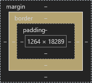
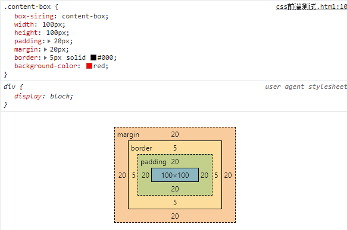
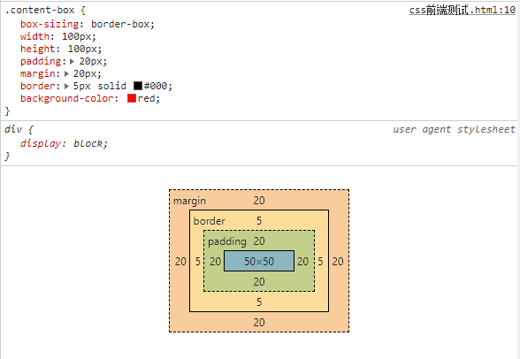

# css基础知识整理第一期：盒模型

> 本期为css基础知识第一期，由浅入深，积少成多，欢迎批评指正！

### 1. 盒模型

> 盒模型(*Box Model*)，是堆砌网页的基本单位。HTML中，所有html元素都可以看做是一个box。通过对不同box的嵌套，堆砌，就会形成一张精美的网页。

##### 1.1 盒模型的构成

就好像原子一样，一个box也是可以拆解成多个部分的，当我们打开一个网页，按下***F12***，就会看到如下一张图：

由此可以清楚地看出，一个box由内而外依次由**content、padding、border、margin**构成。但是这里会引出一个问题，当我们想要设置一个box的宽度和高度时，这四个部分是如何表现的呢？

##### 1.2 盒模型的分类

> 一般情况下，盒模型分为content-box和border-box。
> 可以使用css中的**box-sizing**属性进行设置。

* 1.2.1 当我们打开比较现代的浏览器，新建一个box,如下图所示：

当使用**content-box**时，我们设置box的宽高，其实设置的是**content**的宽高。padding、border、margin并没有受到影响。因此当你单独设置了padding或者border时，实际的box大小是要比你设置的width/height大的。
**这里我们看到box的实际宽度是 width + padding * 2 + border * 2。**

* 1.2.2 当我们打开一个陈旧的令人抓狂的浏览器或者使用border-box时，新建一个box，如下图所示：

当使用**border-box**时，我们设置box的宽高，其实设置的时**content+padding * 2+border * 2**的宽高。因此当你单独设置了padding或者border时，实际的content大小是要比你设置的width/height小的， 但是box大小是不变的。
**这里我们看到box的实际宽度是 width。**

总的来说，**根据 W3C 的规范，元素内容占据的空间是由 width 属性设置的，而内容周围的 padding 和 border 值是另外计算的。**不幸的是，IE5.X 和 6 在怪异模式中使用自己的非标准模型。这些浏览器的 width 属性不是内容的宽度，而是内容、内边距和边框的宽度的总和。虽然有方法解决这个问题。但是目前最好的解决方案是回避这个问题。也就是，不要给元素添加具有指定宽度的内边距，而是尝试将内边距或外边距添加到元素的父元素和子元素。

### 参考文献

[1] https://www.runoob.com/css/css-boxmodel.html